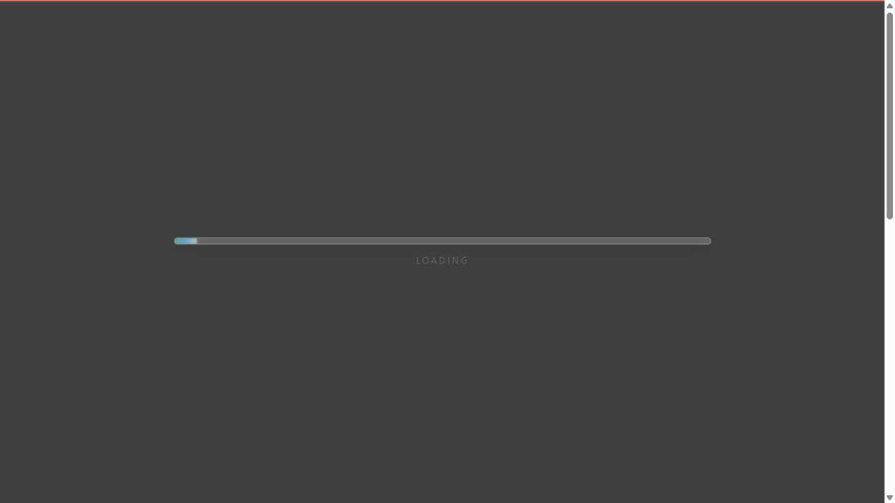
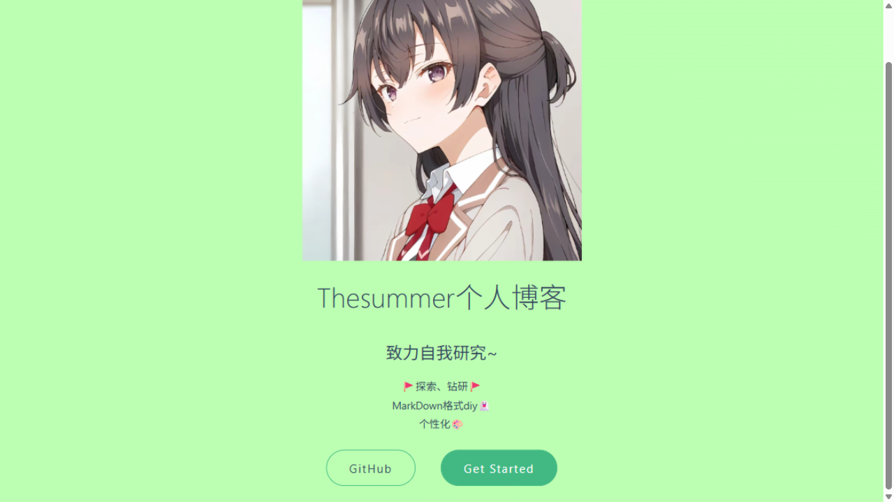
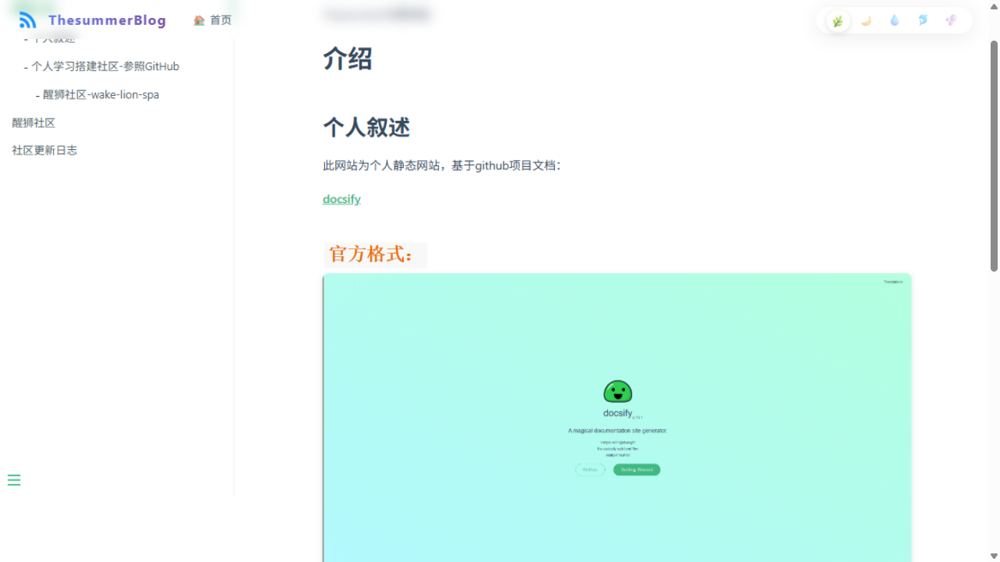
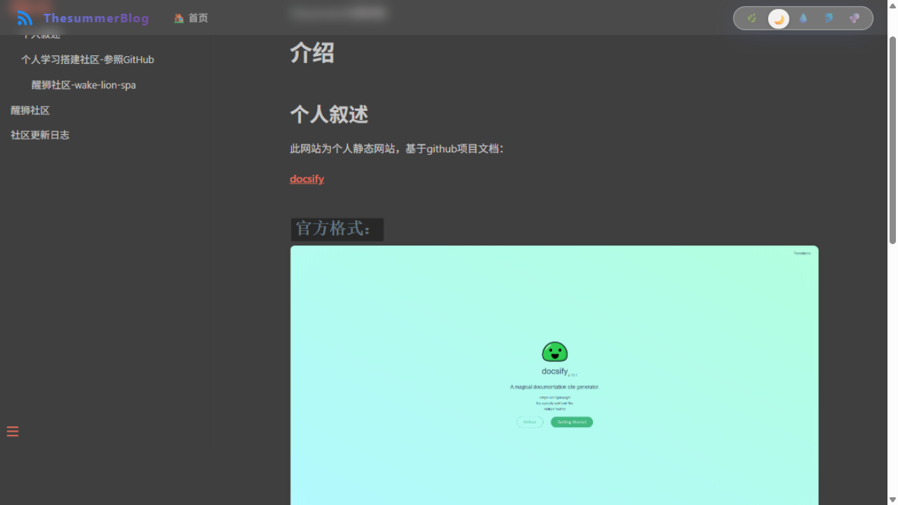

# ThersummerBlog 修复报告

> 修复日期：2026-09-16
> 原则：**保留博客全部原有特色（封面、自定义导航、毛玻璃主题滑块、文档内容、图片），只修复技术层问题。**
> 所有文档内容（`醒狮社区文档/`、`guide.md`、`Ownermd/`、`SchoolNetWork/` 等 `.md` 正文）与所有图片**未做任何修改和删除**；封面页/主页内容同样未动。

---

## 修复总览

| # | 修复项 | 严重度 | 涉及文件 | 状态 |
|---|--------|--------|----------|------|
| 1 | Loading 遮罩可能永久卡死白屏 → 加 4 秒兜底自动隐藏 | 高 | `index.html` | ✅ 已修复并模拟故障验证 |
| 2 | BootCDN 供应链风险 + 断网白屏 → docsify 全量本地自托管 | 高 | `index.html`、新增 `lib/` | ✅ 已修复并验证 |
| 3 | 深色主题下刷新闪白屏 → 遮罩随主题变色 | 中 | `index.html` | ✅ 已修复并截图验证 |
| 4 | 两处重复的主题恢复逻辑、双 `hook.doneEach` → 合并重构 | 中 | `index.html` | ✅ 已修复 |
| 5 | `_navbar.md`/侧边栏中 `.theme-link` 主题链接点击无效 → 事件委托绑定 | 中 | `index.html` | ✅ 已修复 |
| 6 | `package.json` 元数据错误、无本地预览脚本 → 修正 + 添加 `npm run serve` | 中 | `package.json` | ✅ 已修复 |
| 7 | `<html lang="en">`、`title` 拼写不一致、meta description 占位符 → 修正 | 低 | `index.html` | ✅ 已修复 |
| 8 | 死代码：无样式 `.loader-spinner` 空 div、废弃 `@keyframes spin`、注释掉的 `toggleNav` → 清理 | 低 | `index.html` | ✅ 已修复 |
| 9 | 侧边栏缺换行 / `_navbar.md` 全注释（初判） | — | `_sidebar.md` | ⚠️ 复核后确认**无需修改**（见附录 A） |

---

## 修复项 1（高）：Loading 遮罩兜底，杜绝永久白屏

### 问题描述

遮罩的隐藏逻辑**只**挂在 docsify 的 `hook.doneEach` 里。如果 `docsify.min.js` 加载失败（CDN 故障、被墙、断网），hooks 永远不会注册，访客会停在纯白 "LOADING" 页面上，永远进不来。

```
旧逻辑：遮罩隐藏的唯一途径 = docsify 加载成功 → hook.doneEach → 300ms 后隐藏
        docsify 加载失败 → hooks 不存在 → 遮罩永远显示（死白屏）
```

### 修复方法

在主题脚本 IIFE 开头加一个 4 秒兜底定时器，与 docsify 是否加载成功无关：

```js
// index.html —— 主题脚本 IIFE 内新增
var overlayEl = document.getElementById('loading-overlay');

// 兜底：即使 docsify.min.js 加载失败（hooks 永远不会触发），
// 遮罩也会自动消失，页面不会卡在白屏
function hideOverlay() {
  if (overlayEl) overlayEl.classList.add('hide');
}
setTimeout(hideOverlay, 4000);
```

时序对比：

```
修复前：  正常 ──→ docsify加载 ──→ doneEach ──→ 0.3s后隐藏   ✓
          异常 ──→ docsify失败 ──→ (什么都不会发生) ──→ 永久白屏 ✗

修复后：  正常 ──→ doneEach ──→ 0.3s后隐藏（和原来一样）        ✓
          异常 ──→ 4s兜底定时器触发 ──→ 遮罩隐藏                ✓
```

### 验证（故障模拟实测）

临时把 `lib/docsify.min.js` 改名 → 换一个全新端口（绕过浏览器缓存，确认 js 真正 404）→ 加载页面等 5 秒：

| 检查点 | 结果 |
|--------|------|
| `window.Docsify` 是否加载 | `false`（确认脚本真的加载失败） |
| 遮罩 4 秒后是否隐藏 | `overlayHidden: true` |
| 遮罩是否还挡住页面 | `pointerEvents: none`（不挡） |

结论：即使 docsify 完全加载失败，页面也不会再卡死在白屏。

---

## 修复项 2（高）：docsify 全量本地自托管，移除 BootCDN 依赖

### 问题描述

全站 JS/CSS 依赖 `cdn.bootcdn.net`。BootCDN/bootcss 域名在 2024 年 6 月曾发生大规模恶意脚本注入事件（供应链攻击），第三方 CDN 既是安全隐患又是单点故障（挂了就白屏）。

### 修复方法

**第 1 步**：把当前实际使用的 6 个文件下载到仓库新目录 `lib/`：

```
lib/
├── docsify.min.js   (160 KB, v4.13.1)
├── vue.css          (🌿 默认主题)
├── dark.css         (🌙)
├── pure.css         (💧)
├── dolphin.css      (🐬)
└── buble.css        (🫧)
```

**第 2 步**：`index.html` 中 3 处 CDN 引用全部改为本地路径：

```html
<!-- 修改前 -->
<link id="theme-style" rel="stylesheet" href="//cdn.bootcdn.net/ajax/libs/docsify/4.13.1/themes/vue.css">
<script src="//cdn.bootcdn.net/ajax/libs/docsify/4.13.1/docsify.min.js"></script>

<!-- 修改后 -->
<link id="theme-style" rel="stylesheet" href="lib/vue.css">
<script src="lib/docsify.min.js"></script>
```

```js
// 主题切换函数同步修改（修改前为 BootCDN 地址）
var THEME_PATH = 'lib/';
document.getElementById('theme-style').href = THEME_PATH + theme + '.css';
```

**第 3 步**：顺手删除了主题 css 开头的 `@import url("https://fonts.googleapis.com/...")`——Google Fonts 国内访问不到、还会阻塞渲染，而 `index.html` 本来就用 `!important` 覆盖了字体，删除后视觉完全不变（国内原本也加载不到这个字体）。

**收益**：安全（无第三方可注入点）、可靠（资源与站点同源，仓库里文件在资源就在）、国内访问不再依赖任何 CDN。

---

## 修复项 3（中）：深色主题下刷新不再闪白

### 问题描述

`#loading-overlay` 背景写死 `background: #fff`。用户选了 🌙 dark 主题后每次刷新，先闪 0.5~1 秒刺眼白屏再变黑。

### 修复方法

初始化时读取保存的主题，深色则把遮罩同步为 dark 主题的背景色（取自 `lib/dark.css` 的 `body{background-color:#3f3f3f}`）：

```js
// index.html —— 主题脚本 IIFE 内新增
function syncOverlayTheme() {
  if (!overlayEl) return;
  var isDark = getSavedTheme() === 'dark';
  overlayEl.style.background = isDark ? '#3f3f3f' : '#fff';
  overlayEl.style.color = isDark ? '#c8c8c8' : '';
}
// 初始化时调用：
applyTheme(THEMES[currentIndex]);
syncOverlayTheme();
```

### 验证截图（dark 主题下刷新，遮罩为深灰而非白色）



---

## 修复项 4（中）：合并重复逻辑，重构主题脚本

### 问题描述

旧代码问题：
- 主题恢复逻辑写了**两遍**（外层 IIFE 恢复一次、内层滑块 IIFE 又读一次 `localStorage`）；
- 同一个插件里注册了**两个** `hook.doneEach`；
- `toggleTopBar` 里又第三次解析主题数组。

### 修复方法

重构为一个单一 IIFE，主题列表 `THEMES` 只定义一次，所有逻辑（恢复、滑块、遮罩、封面控制）共享：

```js
(function() {
  var THEMES = ['vue', 'dark', 'pure', 'dolphin', 'buble'];  // 唯一的主题清单
  var ICONS  = ['🌿', '🌙', '💧', '🐬', '🫧'];
  var THEME_PATH = 'lib/';

  function getSavedTheme() { /* try/catch 包裹 localStorage 读取 */ }
  function applyTheme(theme) { /* 换 css + body class + 持久化，唯一出口 */ }
  function setTheme(index)  { /* 滑块动画 + applyTheme */ }
  ...
})();
```

行为完全保持原样：滑块点击/空白循环切换、thumb 弹性移动动画、500ms 后初始化位置、封面页隐藏导航——全部不变，只是内部不再重复。

---

## 修复项 5（中）：让 `_navbar.md` 里的主题链接活过来

### 问题描述

`_navbar.md` 中有 5 个 `<span class="theme-link" data-theme="...">` 主题链接，但全站没有任何 JS 绑定它们——点击无任何反应（当前它们还整体被 `.app-nav{display:none}` 隐藏，属于"休眠功能"）。

### 修复方法

在 `index.html` 中用**事件委托**绑定（挂在 `document` 上，docsify 每次路由重渲染导航后依然有效）：

```js
// index.html —— 主题脚本 IIFE 内新增
document.addEventListener('click', function (e) {
  var link = e.target.closest('.theme-link');
  if (!link) return;
  var idx = THEMES.indexOf(link.getAttribute('data-theme'));
  if (idx >= 0) {
    setTheme(idx);
    e.preventDefault();
  }
});
```

效果：今后无论重新显示 `.app-nav`、还是在侧边栏里加主题链接，点击即切换主题并与右上角滑块联动（滑块图标、位置、active 状态同步更新）。

---

## 修复项 6（中）：`package.json` 修正

### 修改前

```json
{
  "name": "docs",
  "version": "1.0.0",
  "description": "> An awesome project.",   ← 模板残留的 markdown 碎片
  "main": "index.js",                        ← 指向不存在的文件
  ...
}
```

### 修改后

```json
{
  "name": "thersummerblog",
  "version": "1.0.0",
  "description": "Thesummer个人博客 — 基于 Docsify 的静态博客（GitHub Pages）",
  "scripts": {
    "serve": "docsify serve .",
    "start": "docsify serve ."
  },
  "devDependencies": {
    "docsify-cli": "^4.4.4"
  },
  "license": "ISC"
}
```

本地预览方式（docsify 必须通过 HTTP 服务访问，直接双击 index.html 打不开）：

```bash
npm install        # 首次安装 docsify-cli
npm run serve      # 启动后访问 http://localhost:3000
```

---

## 修复项 7/8（低）：head 信息与死代码清理

| 位置 | 修改前 | 修改后 |
|------|--------|--------|
| `index.html:2` | `<html lang="en">` | `<html lang="zh-CN">` |
| `index.html:5` | `<title>ThesummerBlogs</title>`（多了个 s，与站名不符） | `<title>ThesummerBlog</title>` |
| `index.html:8` | `<meta name="description" content="Description">` | `content="Thesummer个人博客 — 致力自我研究~"`（与封面标语一致） |
| Loading 遮罩内 | `<div class="loader-spinner"></div>`（对应 CSS 已被注释，渲染一个无样式的空 div） | 已删除该 div |
| `<style>` 内 | 注释掉的 `.loader-spinner` CSS 块、废弃的 `@keyframes spin`、注释掉的 `toggleNav` 整段 | 已删除 |

---

## 视觉验收截图（本地实测）

**封面页（vue 主题，original 特色完全保留：头像、标语、GitHub / Get Started 按钮）：**



**文档页（自定义导航栏 + Logo + 首页链接 + 右上角毛玻璃主题滑块 + 侧边栏 + 文档配图，全部正常）：**



**点击滑块切换 dark 主题（滑块图标/位置联动，样式即时生效，主题持久化到 localStorage）：**



实测还确认：`醒狮社区测试.md` 中 `../images/...` 相对路径的 markdown 图片正常加载（`naturalWidth > 0`），文档零改动。

---

## 附录 A：一次误判的更正

初版分析中曾报告"_sidebar.md 第 5 行缺换行，两个条目挤在一行"。**复核后确认是误判**：当时把多个文件用 `cat` 连在一起查看，`_sidebar.md`（无末尾换行符）的末尾与 `_navbar.md` 的开头 `* [🏠 首页](/)` 拼接在了一起，看起来像同一行。实际两个文件各自格式正确，因此**本次未改动 `_sidebar.md` 和 `_navbar.md`**。

同理更正：`_navbar.md` 并非"全部被注释"，它有真实内容（首页 + 🎨 主题菜单），只是被 `index.html` 的 `.app-nav { display: none !important }` 整体隐藏（自定义导航栏取代了它）。故保留 `loadNavbar: true` 不动。

## 附录 B：本次刻意保留、未修改的事项（遵守约束）

以下问题在初版分析中提到，但因"文档内容和图片不修改/不删除、主页不变"的约束**原样保留**，仅在此记录供日后自行决定：

1. **首页 `README.md` 仍是模板内容**（`# Headline > An awesome project.` + `## 测试文件`）——主页内容未动。
2. **封面 `_coverpage.md` 的 GitHub 按钮仍指向 `docsifyjs/docsify`**（模板默认仓库）——封面未动。
3. **重复图片**：`醒狮社区文档/图片/xw_20260502111022.png` 与 `images/醒狮社区/xw_20260502111022.png` 内容重复（前者未被任何文档引用），未删除。
4. **文档内图片路径写法不统一**（`醒狮社区测试.md` 用 `../images/...`，`Thesummer个人专属博客.md` 用 `images/...`）——实测当前部署方式（域名根路径）下两者都能正常显示，未改动。
5. `zh-cn.md`（内容仅"简体中文"）——未动。
6. `SchoolNetWork/`、`Ownermd/` 目录仍无侧边栏入口（`_sidebar.md` 注释中预留）——未动。

## 附录 C：改动文件清单

```
修改：index.html      （head 信息、主题脚本重构、遮罩兜底、.theme-link 绑定、死代码清理）
修改：package.json    （元数据修正、新增 serve 脚本与 docsify-cli 依赖）
新增：lib/docsify.min.js + 5 个主题 css   （docsify v4.13.1 本地自托管，已去除 Google Fonts @import）
新增：修复报告.md、report-assets/          （本报告及验收截图）
未动：所有 .md 文档内容、所有图片、封面页、_sidebar.md、_navbar.md、zh-cn.md、guide.md
```
